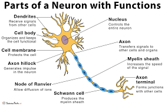
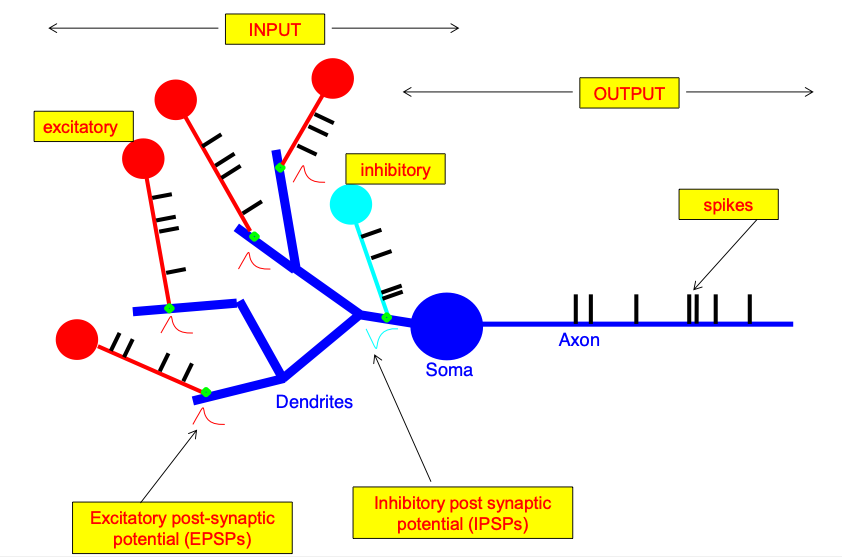
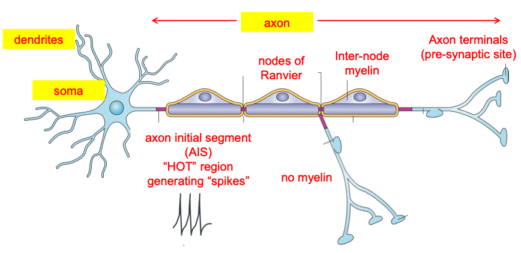
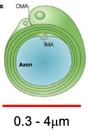
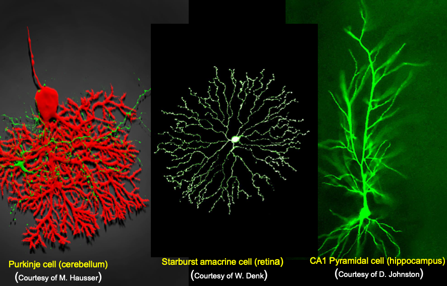
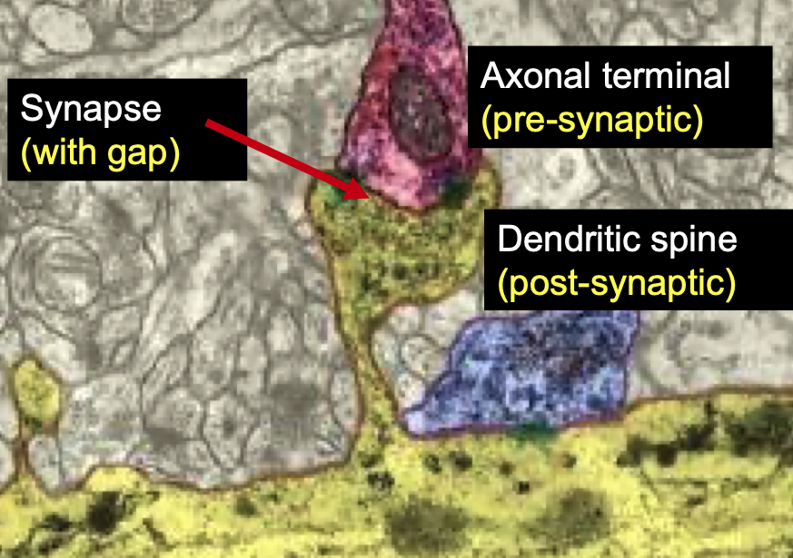
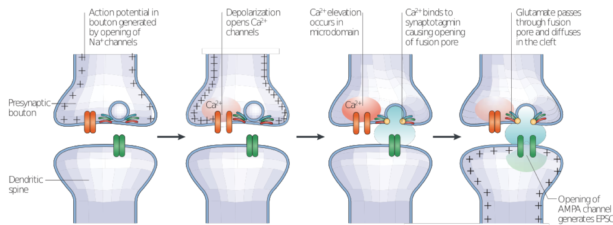

# Lesson 2

## Plan:
> 1. The Neuron
> 2. Neuron as an I/O Device (Part I)
> 3. The Axon
> 4. The Dendrite
> 5. Neuron Types
> 6. The Synapse
> 7. Neuron as an I/O Device (Part II)

## 1. The Neuron
### **Historical Account**

| Year | Person | Breakthrough | 
| ---- | ------ | :----------- | 
| 1665 | Robert Hooke | First use of microscope to view living cells |
| 1839 | Theodor Schwann | The "Cell Theory", but is this true for the brain? |
 1870 | Camilo Golgi | Development of a silver-based method for randomly staining nerve cells |
| 1887 | S. Ramon Y. Cajal | Application of Golgi's silver method for drawing of individual neurons, a.k.a. the "Neuron Doctrine" |
| 1891 | Hienrich Waldeyer | Coining of the word "Neuron" |
| 1897 | Charles Sherrington | Coining of the word "Synapse" |

### **Golgi vs Cajal Controversy**
When Ramon y Cajal drew the neurons, his paintings suggested that information flows along the many long "processes", and then gets transmitted to another branch (disonnected). This goes on till there're no branches left. 

The second step of the above process suggests a certain polarisation that occurs for information transmission, and so it's termed the "Theory of Dynamic Polarisation".

Golgi completely disagreed with this, believing instead that all the cells are connected physically, negating the need for synaptic connections. He went so far as to criticise Ramon y Cajal's idea on the podium in 1906 during the Nobel Prize presentations.

Today, we accept Ramon y Cajal's idea, with the dendrites being receptive devices (input) and the axon being the sending device (output). A labelled image of a typical neuron is shown above.

## 2. Neuron as an I/O Device (Part I)
### **Conceptual Overview**
The blue neuron is the **post-synaptic** neuron, the receiving neuron. The red neurons are the **pre-synpatic** neurons, the sending neurons.

These 2 form synaptic contact for transmission. When contact is made, there is a change in voltage (potential difference).

There is also another neuron coloured cyan, and its job is to decrease the potential difference by providing an inhibitory potential.

The output of the cell is then shown as electrical spikes. Notice that the post-synaptic cell receives the input at its dendrites from two types of cells, and the output comes through its axon. This aligns with both of Ramon y Cajal's ideas ("Neuron Doctrine" and "Theory of Dynamic Polarisation")as mentioned previously.

## 3. The Axon
The sending part of the neuron is the axon. It consists of:
- Axon Initial Segment (AIS)
- Nodes of Ranvier
- Myelin Sheath
- Varicosities

There are certain "hot" regions, and these are not covered by the myelin sheath. This includes the AIS, Nodes of Ranvier, and the varicosities (terminals).

### **Myelin Sheath**
The myelin sheath is quite unique to the axon. In fact, if you observe the presence of myelin, you're probably looking at an axon. 

The myelin sheath is formed using either myelinating glial cells (oligodendrocytes) in the central nervous system or Schwann cells in the peripheral nervous system. These cells are enwrapped several times around the axon to serve as the myelin sheath.

### **Node of Ranvier**
There exists ion channels at these nodes of Ranvier, allowing for the boosting of electrical signals. This serves an important function since signals get attenuated over any distance. The signals are amplified at the nodes of Ranvier, and so the electrical signals at the AIS will end up at the varicosities unattenuated.

## 4. The Dendrite
Individual dendrites come together to form the dendritic tree, and these make for beautiful structures such as those shown below.

Notice that the names of these cells seem to depend on the structures of the dendritic trees.

Ramon y Cajal also drew non-smooth dendrites for those are what he saw through his microscope. He did not know how, but he imagined that this spiny nature is crucial to the functioning of the brain.

Today, we know these as "dendritic spines", and they are crucial pieces of the neuron because that's where synapses form. Not all dendrites have "dendritic spines", however. There are smooth dendrites.

Typical numbers:
- Total dendritic area ~ 20,000 ${\mu m^2}$
- Number of Dendritic Spines per cell ~ 8,000
- Spine Area ~ 1 ${\mu m^2}$
- Number of converging inputs ~ 10,000

These are ballpark figures, and there are many different types of neurons exhibiting slightly different numbers. The numbers are here to demonstrate how connected these cells are.

# 5. Neuron Types
There are many ways of classifying neurons; we've already done so in two ways (spiny vs smooth, excitatory vs inhibitory). Below shows the various bases for classification:
- Anatomical Features
- Function
- Morphology
- Temporal Spiking Activity Pattern
- Chemical Characteristics
- Gene Expression

Another way to look at neurons is Principal Neurons vs Interneurons:

| Type | Identifier |
| ---- | ------- |
| Principal Neurons | Their axons project to other brain regions, tend to be excitatory |
| Interneurons | Local axonal projections, tend to be inhibitory |

These interneurons can be further classified based on morphology. This was attempted by Dr. Javier DeFelipe and his team in their 2013 [paper](https://www.nature.com/articles/nrn3444).

## 6. The Synapse

This is where the electrical spikes get transmitted from the pre-synaptic axon terminal to the post-synaptic dendrite. This happens at the dendritic spines without the need of actual contact. The signal from the pre-synaptic axon is a very fast pulse that can be treated as a digital 1 or 0. The post-synaptic signal has a much smaller gradient to its decay, meaning it's more analogue. Thus, in a way, the process of transmission at the synapse includes a digital-to-analogue conversion. In fact, there are many possible results depending on the type of synapse formed.

Transmission can be characterised through a highly chemical process, in particular via ions.

The 