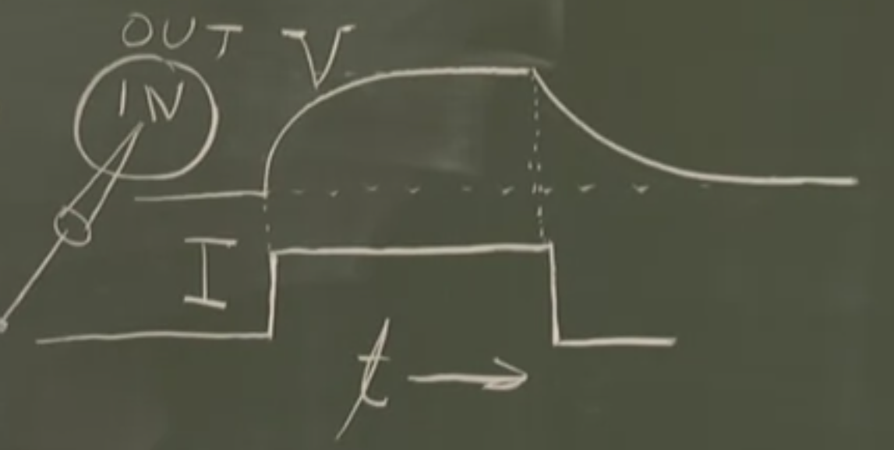
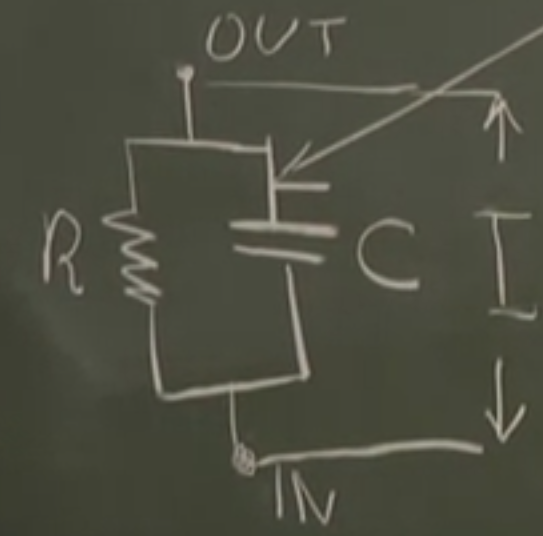
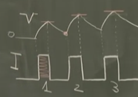
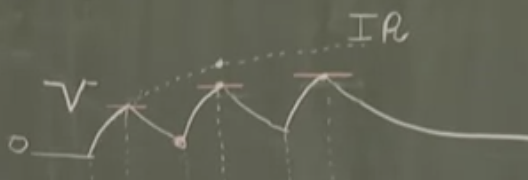
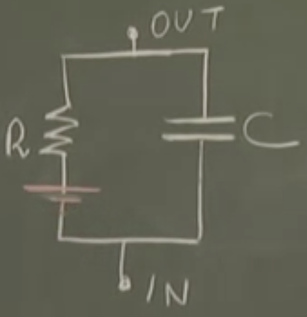

# Lesson 3

## Plan:
> 1. Neurons as Passive R-C Circuits
> 2. The Membrane Time Constant ${\tau_m}$ 
> 3. Temporal Summation
> 4. Resting Potential
> 5. Excitatory (E) and Inhibitory (I) Synapses
> 6. Excitatory and Inhibitory Interaction

## 1. Neurons as Passive R-C Circuits

We will be taking the potential difference between the ***inside*** of the neuron and the ***outside*** of the neuron. For the purposes of a starting point, let's assume that the neuron is simply a spherical membrane (isopotential; no change of potential difference within the sphere). We are essentially looking at the behaviour of this membrane. 

When subject to a constant pulse of current, we observe the following.

The potential difference takes time to grow while the current is being injected. When the current injection stops, the potential difference is attenuated to 0 over time.

This is surprising; the membrane does not act purely as a resistor (that would mean perfectly flat potential difference upon injection, and then 0 upon removal of current), but more like an RC circuit. 

Why? Let's explain the charging process (discharging will become obvious). Mathematically, the capacitative current and resistive current must sum to the injected current (Kirchoff's Current Law).

$$
\displaystyle C \frac{dV}{dt} + \frac{V}{R} = I
$$

Given the initial condition ${V(0) = 0}$, we can solve this 1D ODE which gives us the equation below that accurately models the behaviour observed.

$$
\displaystyle V(t) = IR (1 - e^{-\frac{t}{RC}})
$$

Here's the derivation
$$\displaystyle C (s\upsilon(s) - V(0)) + \frac{1}{R}\upsilon(s) = \frac{I}{s}$$
$$\displaystyle \upsilon(s) = \frac{I}{C} \frac{1}{s(s + \frac{1}{RC})}$$
$$\displaystyle \mathscr{L}^{-1}[\frac{1}{s(s + \frac{1}{RC})}] = RC (1 - e^{-\frac{t}{RC}})$$
$$\displaystyle \therefore V(t) = IR (1 - e^{-\frac{t}{RC}})$$

## 2. The Membrane Time Constant ${\tau_m}$

Let's look at the equation above again. We know it works for ${V(t = 0) = 0}$ and ${V(t = \infty) = IR}$. The latter one is the steady state result which just means that the capacitor has been fully charged and so current only flows through the resistor.

Now we want to look at a particular case ${t = RC}$ and this is, in fact, the membrane time constant ${\tau_m = RC}$.

$$
\displaystyle V(t = RC) = IR(1 - e^{-\frac{RC}{RC}}) = IR(1 - e^{-1}) \approx 0.63 IR
$$

This parameter governs the speed of the voltage response to a current step input. If it's small, it takes shorter to charge / discharge and the opposite is true.

The neuron's input resistance ${R_{in}}$ is another crucial parameter. While it is part of the membrane time constant ${\tau_m}$, it also decides the steady state potential difference that can be reached. These 2 serve as the main parameters for understanding the passive linear approximation of the neuron.

## 3. Temporal Summation

This is a consequence of having the membrane time constant. Imagine this: we inject repeated current step pulses with intermissions. If the intermissions are short enough relative to the pulse durations, we have a buildup of potential difference due to discharging occurring less than charging. This process is called "temporal summation".

This happens when the intermission period is in the order of the membrane time constant ${\tau_m}$. Give it a moment and you'll notice that this is exactly what the neuron is doing:
- Binary data coming in and Analogue data prepared for the axon
- Positive and Negative current step inputs correspond to Excitatory and Inhibitory synapses respectively
- Input signals are getting "summed up" chronologically

By summing temporally with intermissions, the peaks of the voltage spikes will always be lower than if there were no intermissions at all. The latter is the maximum we can get (IR). We can see in the graph below that it serves as a bound for actual voltage spikes.

Temporal summation can only really happen if the intermission durations are in the order of the membrane time constant; if it's too long, too much of the voltage gets attenuated. The output has to reflect the interplay between inhibitory and excitatory synaptic current injections, and too much attenuation doesn't allow for an accurate reflection.

## 4. Resting Potential

Without injection of any current, the nerve cell is more negative than its external surroundings by ~70mV. This is its resting potential. To account for this in our circuit model, we need to add a battery in series, suggesting that the inside is more negative than the outside (negative terminal faces the inside and positive terminal faces outside).

The resting potential is the reference frame. Going lower than that is called "***Hyperpolarisation***" and going higher than that is called "***Depolarisation***".

