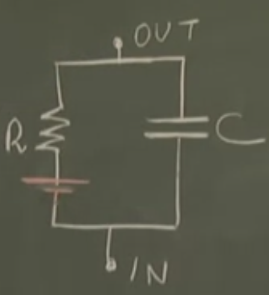
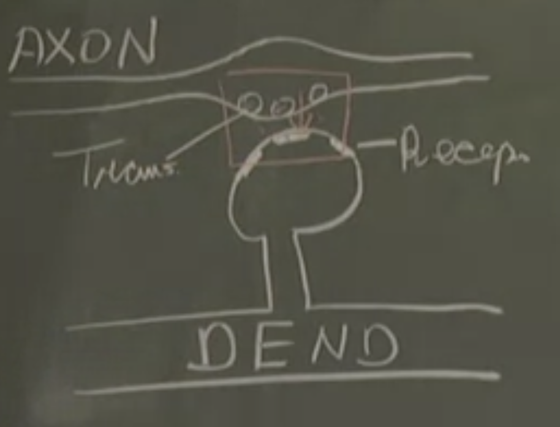

# Lesson 3

## Plan:
> 1. Neurons as Passive R-C Circuits
> 2. The Membrane Time Constant ${\tau_m}$ 
> 3. Temporal Summation
> 4. The Resting Potential
> 5. The Synaptic Potential
> 6. Excitatory (E) and Inhibitory (I) Synapses
> 7. Excitatory and Inhibitory Interaction

## 1. Neurons as Passive R-C Circuits

We will be taking the potential difference between the ***inside*** of the neuron and the ***outside*** of the neuron. For the purposes of a starting point, let's assume that the neuron is simply a spherical membrane (isopotential; no change of potential difference within the sphere). We are essentially looking at the behaviour of this membrane. 

When subject to a constant pulse of current, we observe the following.

The potential difference takes time to grow while the current is being injected. When the current injection stops, the potential difference is attenuated to 0 over time.

This is surprising; the membrane does not act purely as a resistor (that would mean perfectly flat potential difference upon injection, and then 0 upon removal of current), but more like an RC circuit. 

Why? Let's explain the charging process (discharging will become obvious). Mathematically, the capacitative current and resistive current must sum to the injected current (Kirchoff's Current Law).

$$
\displaystyle C \frac{dV}{dt} + \frac{V}{R} = I
$$

Given the initial condition ${V(0) = 0}$, we can solve this 1D ODE which gives us the equation below that accurately models the behaviour observed.

$$
\displaystyle V(t) = IR (1 - e^{-\frac{t}{RC}})
$$

Here's the derivation
$$\displaystyle C (s\upsilon(s) - V(0)) + \frac{1}{R}\upsilon(s) = \frac{I}{s}$$
$$\displaystyle \upsilon(s) = \frac{I}{C} \frac{1}{s(s + \frac{1}{RC})}$$
$$\displaystyle \mathscr{L}^{-1}[\frac{1}{s(s + \frac{1}{RC})}] = RC (1 - e^{-\frac{t}{RC}})$$
$$\displaystyle \therefore V(t) = IR (1 - e^{-\frac{t}{RC}})$$

## 2. The Membrane Time Constant ${\tau_m}$

Let's look at the equation above again. We know it works for ${V(t = 0) = 0}$ and ${V(t = \infty) = IR}$. The latter one is the steady state result which just means that the capacitor has been fully charged and so current only flows through the resistor.

Now we want to look at a particular case ${t = RC}$ and this is, in fact, the membrane time constant ${\tau_m = RC}$.

$$
\displaystyle V(t = RC) = IR(1 - e^{-\frac{RC}{RC}}) = IR(1 - e^{-1}) \approx 0.63 IR
$$

This parameter governs the speed of the voltage response to a current step input. If it's small, it takes shorter to charge / discharge and the opposite is true. A ballpark value for the membrane time constant ${\tau_m = RC = 20 milliseconds}$. It could go lower than this depending on how leaky the circuit is.

The neuron's input resistance ${R_{in}}$ is another crucial parameter. While it is part of the membrane time constant ${\tau_m}$, it also decides the steady state potential difference that can be reached. These 2 serve as the main parameters for understanding the passive linear approximation of the neuron.

## 3. Temporal Summation

This is a consequence of us having the membrane time constant. Imagine this: we inject repeated current step pulses with intermissions. If the intermissions are short enough relative to the pulse durations, we have a buildup of potential difference due to discharging occurring less than charging. This process is called "temporal summation".

This happens when the intermission period is in the order of the membrane time constant ${\tau_m}$. Consider the case of the intermission period being too long: the voltage will simply go to 0.

Give it a moment and you'll notice that this process exactly mimicks the dendrite-to-axon voltage build-up:
- Binary data coming in and Analogue data prepared for the axon
- Positive and Negative current step inputs correspond to Excitatory and Inhibitory synapses respectively
- Input signals are getting "summed up" chronologically

## 4. The Resting Potential

Experiments have shown that the internals of the cell exhibit a negative potential of **-70mV**. This is the **Resting Potential**. 

i.e. At rest, the cell sits at 70mV more negative than the surroundings.

Because of the Resting Potential, we must include a battery in the RC model of the neuron, ensuring proper connections of the positive and negative terminals (the negative terminal faces the **inside** and the positive terminal faces the **outside**):

Thus, every current injection causes a voltage change *relative* to the Resting Potential.

Positive current is depolarising - carrying the voltage towards positivity. 

Negative current is hyperpolarising - carrying the voltage towards greater negativity.

## 5. The Synaptic Potential

One crucial thing to note from the previous models: no one's actually injecting currents externally into the neuron. Naturally, one will ask: Where do the currents come from???

Answer: Synapses

Recall the following process:

The Pre-Synaptic Axon and Post-Synaptic Dendrite experience a spike in which communication occurs between the two parts. The chemical process leads to opening of new ion channels, creating new paths for current. The new "synaptic" channels open only when transmitters are released. These are modelled by a series connection of a switch, a variable resistor of conductance ${g_{syn}}$, and a battery ${E_{syn}}$, and this part is connected in parallel with the rest of the circuit mentioned before.

To understand this more clearly, the dendrite has both passive and synaptic ion channels. The passive channels are always on, so there is no need for a switch there. However, the synaptic ion channels only open when transmitters are released and interact with the dendrite's receptors. This explains the existence of a series switch in the model. 

## 6. Excitatory (E) and Inhibitory (I) Synapses